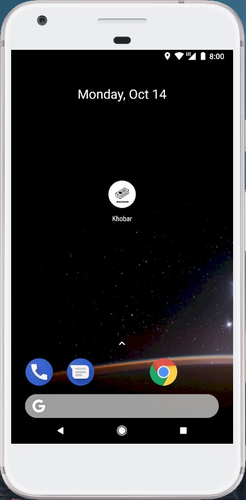
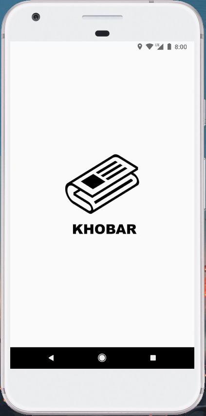
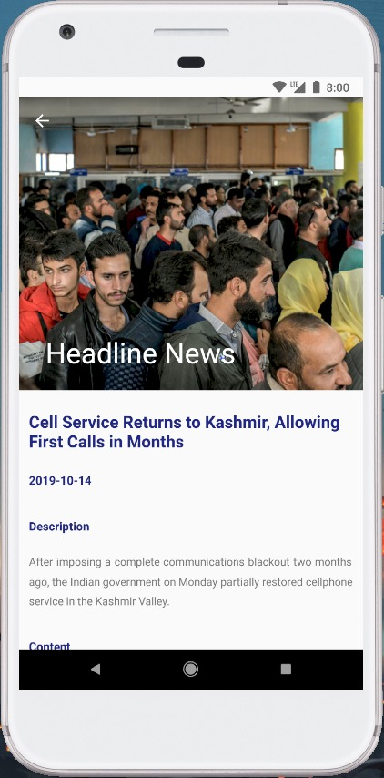
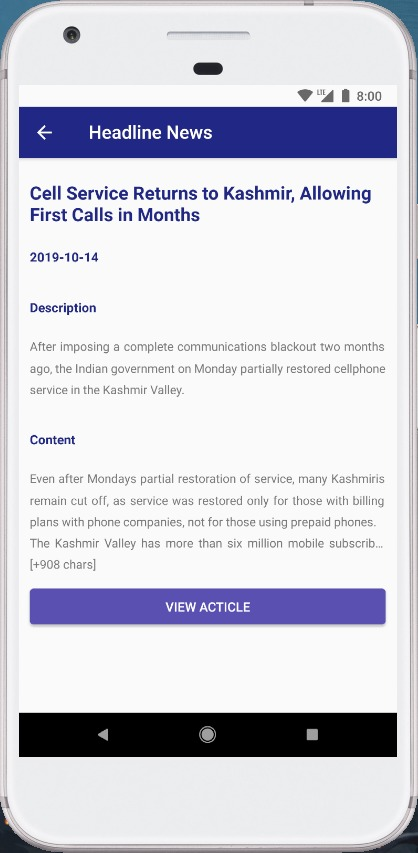
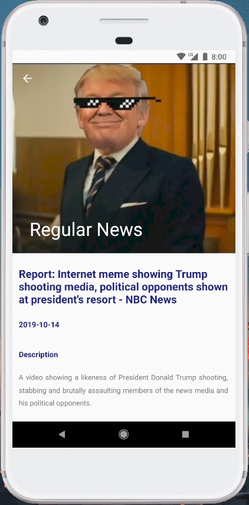
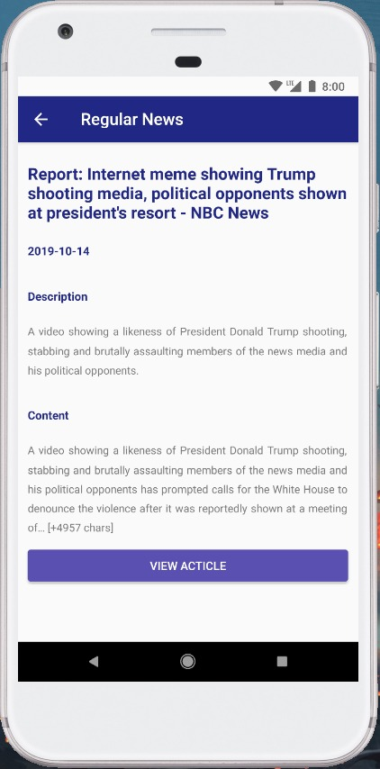
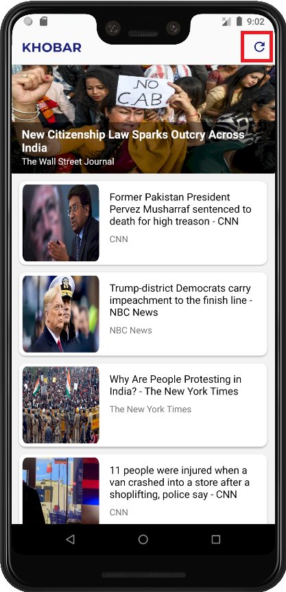

## Khobar

Aplikasi penyedia berita dari News API (newsapi.org)

### User Manual

##### 1. Membuka Aplikasi 

Launcher dari aplikasi Khobar bergambar ilustrasi koran dengan nama Khobar. User dapat menekan launcher tersebut untuk membuka aplikasi.

##### 2. Membuka Aplikasi 

Setelah aplikasi terbuka user akan menunggu loading selama 2 detik sembari melihat logo dari aplikasi.

##### 3. Tampilan Utama
 

Setelah loading selesai maka user akan diarahkan ke tampilan utama dari aplikasi, disini user akan melihat daftar berita yang ditulis. Ada 2 jenis daftar berita, yakni daftar berita utama (1) dan daftar berita harian (2). Daftar berita utama dapat digulung secara horizontal dan daftar berita harian dapat digulung secara vertikal. User dapat menekan pada salah satu berita untuk melihat deskripsi dari berita tersebut.

##### 4. Tampilan Deskripsi Berita (Headline News)
 

Setelah user memutuskan untuk memilih dan menekan pada salah satu jenis berita, maka deskripsi dari berita yang dipilih tersebut akan ditampilkan pada halaman ini. User dapat menggulung halaman untuk melihat seluruh deskripsi berita.

##### 5. Tampilan Deskripsi Lengkap Berita (Headline News)
 

Di sini user dapat melihat judul secara lengkap, tanggal ditulisnya berita, deskripsi dan konten dari berita. Di paling bawah halaman, user akan menemukan sebuah tombol “view article” yang apabila ditekan akan mengarahkan user pada halaman berita (website), tujuannya agar user dapat membaca isi berita secara lengkap.

##### 6. Tampilan Deskripsi Berita (Regular News)
 

Setelah user memutuskan untuk memilih dan menekan pada salah satu jenis berita, maka deskripsi dari berita yang dipilih tersebut akan ditampilkan pada halaman ini. User dapat menggulung halaman untuk melihat seluruh deskripsi berita.

##### 7. Tampilan Deskripsi Lengkap Berita (Regular News)
 

Di sini user dapat melihat judul secara lengkap, tanggal ditulisnya berita, deskripsi dan konten dari berita. Di paling bawah halaman, user akan menemukan sebuah tombol “view article” yang apabila ditekan akan mengarahkan user pada halaman berita (website), tujuannya agar user dapat membaca isi berita secara lengkap.

##### UPDATE PROJECT

##### 8. Tampilan Halaman Utama Aplikasi Setelah Update

Gambar 8 adalah tampilan utama aplikasi setelah update dari tugas saat Ujian Tengah Semester (UTS) di mana terdapat fitur baru yaitu online-offline. Pada Gambar 8 terdapat tombol untuk melakukan penyegaran atau refresh berita untuk menerima berita terbaru.

Pembaruan dengan menggunakan mekanisme offline-online ini membuat user lebih menghemat data yang digunakan karena data akan diunduh terlebih dahulu kemudian disimpan pada database lokal. Tidak hanya itu, pengaksesan berita juga menjadi lebih cepat karena tidak perlu mengunduh data setiap kali berita dipilih.

Pengimplementasian offline-online ini juga sangat membantu user, apabila user tidak memiliki koneksi internet maka user akan tetap dapat mengakses berita yang telah tersimpan di database lokal.